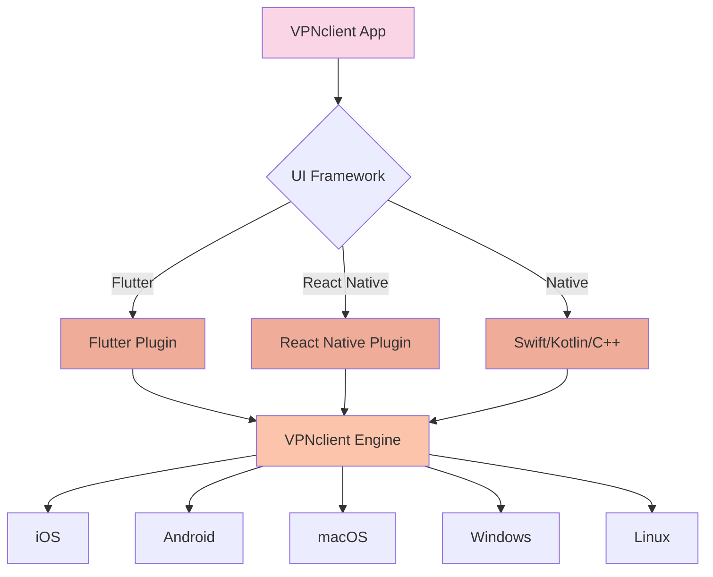
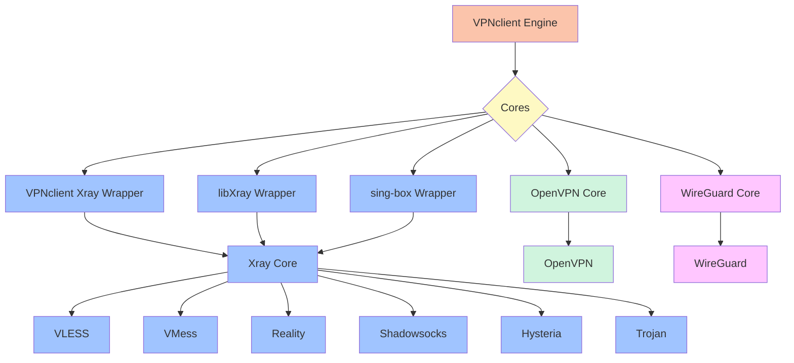
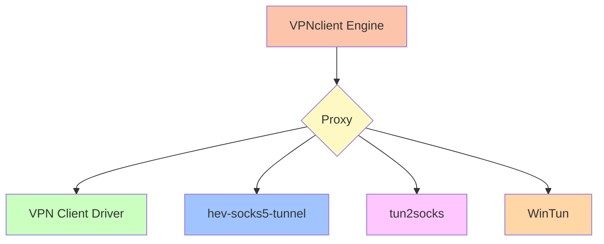

# VPN Client

[🇬🇧 English](README.md) | [🇷🇺 Русский](README_ru.md) | [🇹🇭 ไทย](README_th.md) | [🇨🇳 中文](README_zh.md)

---

**VPN 客户端** 是一个支持多种内核和协议的跨平台 VPN 客户端。

## 🚀 主要功能

- **多协议支持**：Xray（VMess、VLESS、Reality、Shadowsocks、Trojan、SSH）、OpenVPN、WireGuard，以及 SOCKS5/HTTP/HTTPS 代理。
- **跨平台兼容**：支持 iOS、Android、macOS、Windows 和 Linux。
- **高性能**：iOS 使用 Swift、Android 使用 Kotlin 开发核心功能，关键组件使用 C++ 和 Golang 编写，确保速度和稳定性。

## 🖥️ 支持的平台

- ✅ iOS（15.0 及以上）
- ✅ Android（5.0 及以上）
- ✅ macOS（Intel/Silicon）
- ✅ Windows
- ✅ Unix（Linux/Debian/Ubuntu）

## 📦 架构

VPN 客户端的架构分为多个层级：

1. **VPNclient-engine**  
   各平台通用的核心引擎。负责 VPN 设置与管理、流量路由、操作系统集成以及与 VPN 协议（OpenVPN、WireGuard、Xray 等）的通信。

2. **平台适配层：**
   - **[VPNclient-engine-flutter](https://github.com/VPNclient/VPNclient-engine-flutter)**  
     使用 `MethodChannel` 与原生代码交互的 Flutter 插件，支持在 Flutter 应用中集成 VPNclient-engine。
   - **[VPNclient-engine-react-native](https://github.com/VPNclient/VPNclient-engine-flutter)**  
     使用 `NativeModules` 的 React Native 包装器，在 React Native 应用中集成 VPNclient-engine。

3. **VPN 客户端应用**  
   使用 Flutter 构建的应用，调用上述封装来管理 VPN 会话并显示连接状态。

架构图（点击展开）

---

## ⚙️ 支持的协议

- VLESS
- VMess
- Reality
- Shadowsocks
- Hysteria
- Trojan
- OpenVPN
- WireGuard

---

## ⚙️ 支持的核心与封装器

- 🔌 **Xray Core**，通过以下封装器：
  - [VPNclient Xray Wrapper](https://github.com/VPNclient/VPNclient-xray-wrapper)
  - [libXray Wrapper](https://github.com/VPNclient/VPNclient-libXray)
  - sing-box Wrapper
- 🔐 **OpenVPN Core**
- ⚡ **WireGuard Core**

🧠 核心支持图（点击展开）

---

## 🧦 支持的代理驱动

- 🧦 [VPN Client Driver](https://github.com/VPNclient/VPNclient-driver)
- 🧦 [hev-socks5-tunnel](https://github.com/VPNclient/VPNclient-hev-socks5-tunnel)
- 🧦 [tun2socks](https://github.com/VPNclient/VPNclient-tun2socks)
- 🧦 WinTun

🧵 代理驱动图（点击展开）

## 📂 代码仓库

| 组件 | 仓库地址 |
|------|----------|
| 🌐 VPN 客户端应用（Flutter） | [VPNclient-app](https://github.com/VPNclient/VPNclient-app) |
| 📱 VPN 客户端引擎（Flutter 插件） | [VPNclient-engine-flutter](https://github.com/VPNclient/VPNclient-engine-flutter) |
| 📱 VPN 客户端引擎（React Native 插件） | [VPNclient-engine-react-native](https://github.com/VPNclient/VPNclient-engine-react-native) |
| 🤖 VPN 客户端核心引擎 | [VPNclient-engine](https://github.com/VPNclient/VPNclient-engine) |

## 示例应用

- **[SuperHit-VPNclient-app](https://github.com/VPNclient/SuperHit-VPNclient-app)**
- **[fineVPN-VPNclient-app](https://github.com/VPNclient/fineVPN-VPNclient-app)**

---

## 💪 为什么选择 VPN 客户端？

- 🔧 **系统级原生集成**
- 🧩 **模块化且灵活的架构**
- 💻 **开源项目**，采用 Extended GPLv3 协议

---

## 🛠 入门指南

选择上方适合的仓库，按照其 `README.md` 中的说明进行操作。

---

## 📄 许可证

本项目采用 **Extended GPLv3** 协议开源。  
详见 [LICENSE](LICENSE.md) 文件。

---

## 📬 联系方式

更多信息请访问官网 🌐 [vpnclient.click](https://vpnclient.click)
