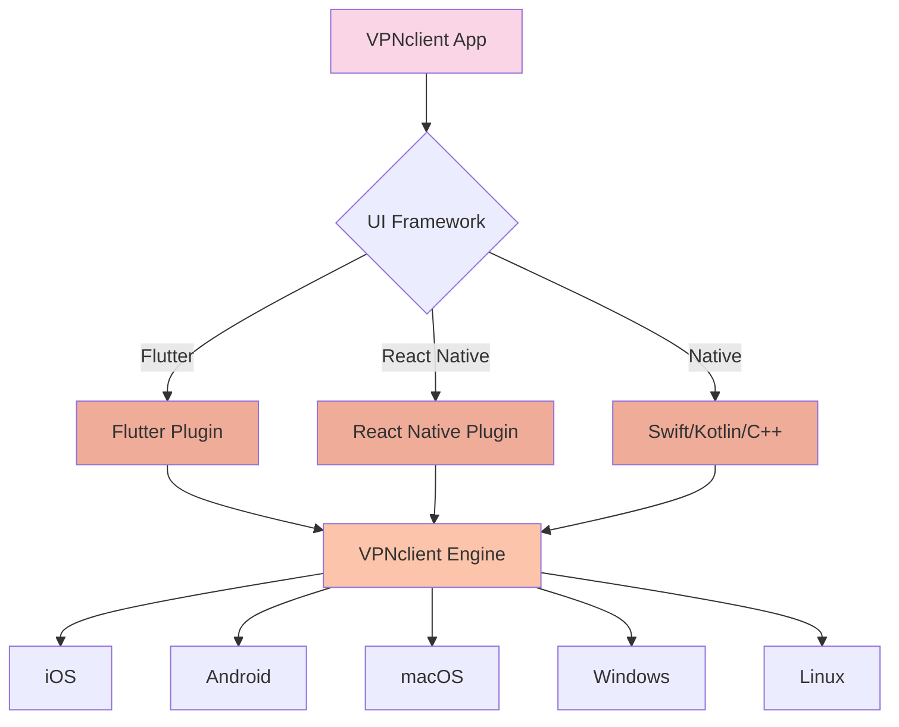
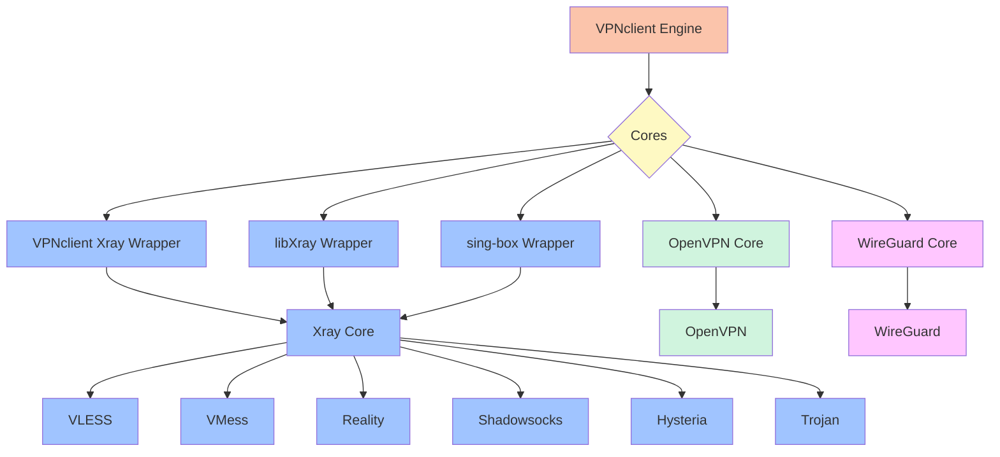
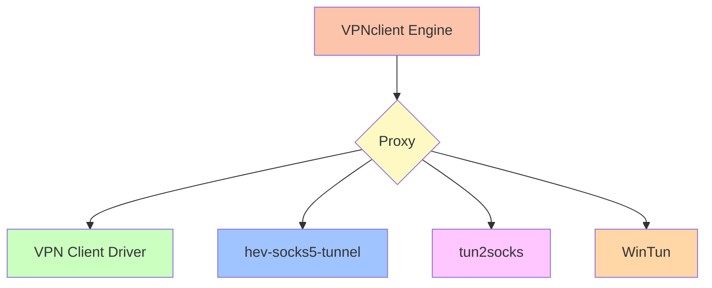

# VPN Client

[🇬🇧 English](README.md) | [🇷🇺 Русский](README_ru.md) | [🇹🇭 ไทย](README_th.md) | [🇨🇳 中文](README_zh.md)
---

**VPN Client** is a cross-platform VPN client supporting multiple cores and protocols.

## 🚀 Key Features

- **Multi-protocol support**: Xray (VMess, VLESS, Reality, Shadowsocks, Trojan, SSH), OpenVPN, WireGuard, as well as SOCKS5/HTTP/HTTPS proxy.
- **Cross-platform**: Available for iOS, Android, macOS, Windows, and Linux.
- **High performance**: Native functionality implemented in Swift (iOS) and Kotlin (Android), and critical components written in C++ and Golang ensure speed and stability.

## 🖥️ Supported Platforms

- ✅ iOS (15.0+)
- ✅ Android (5.0+) 
- ✅ macOS (Intel/Silicon)
- ✅ Windows  
- ✅ Unix (Linux/Debian/Ubuntu)

## 📦 Architecture

VPN Client architecture is structured across several layers:

1. **VPNclient-engine**  
   The core engine for various platforms. Handles VPN setup and management, traffic routing, OS integration, and communication with VPN protocols (OpenVPN, WireGuard, Xray, etc.).

2. **Platform Wrappers:**
   - **[VPNclient-engine-flutter](https://github.com/VPNclient/VPNclient-engine-flutter)**  
     Flutter plugin using `MethodChannel` to interact with native code. Allows using VPNclient-engine in cross-platform Flutter apps.
   - **[VPNclient-engine-react-native](https://github.com/VPNclient/VPNclient-engine-flutter)**  
     React Native wrapper via `NativeModules`. Provides the same VPNclient-engine integration for React Native apps.

3. **VPN Client App**  
   A Flutter-based application utilizing the wrappers to manage VPN sessions and display connection status.

Architecture Diagram(click to expand)

   

---

## ⚙️ Supported Protocols

- VLESS
- VMess
- Reality
- Shadowsocks
- Hysteria
- Trojan
- OpenVPN
- WireGuard

---

## ⚙️ Supported Cores & Wrappers

- 🔌 **Xray Core** via:
  - [VPNclient Xray Wrapper](https://github.com/VPNclient/VPNclient-xray-wrapper)
  - [libXray Wrapper](https://github.com/VPNclient/VPNclient-libXray)
  - sing-box Wrapper
- 🔐 **OpenVPN Core**
- ⚡ **WireGuard Core**
  

🧠 Core Support Diagram (click to expand)

---

## 🧦 Supported Proxy Drivers

- 🧦 [VPN Client Driver](https://github.com/VPNclient/VPNclient-driver)
- 🧦 [hev-socks5-tunnel](https://github.com/VPNclient/VPNclient-hev-socks5-tunnel)
- 🧦 [tun2socks](https://github.com/VPNclient/VPNclient-tun2socks)
- 🧦 WinTun

🧵 Proxy Driver Diagram (click to expand)

## 📂 Repositories

| Component | Repository |
|----------|------------|
| 🌐 VPN Client App (Flutter) | [VPNclient-app](https://github.com/VPNclient/VPNclient-app) |
| 📱 VPN Client Engine (Flutter Plugin) | [VPNclient-engine-flutter](https://github.com/VPNclient/VPNclient-engine-flutter) |
| 📱 VPN Client Engine (React Native Plugin) | [VPNclient-engine-react-native](https://github.com/VPNclient/VPNclient-engine-react-native) |
| 🤖 VPN Client Engine | [VPNclient-engine](https://github.com/VPNclient/VPNclient-engine) |

## Example Apps

- **[SuperHit-VPNclient-app](https://github.com/VPNclient/SuperHit-VPNclient-app)**
- **[fineVPN-VPNclient-app](https://github.com/VPNclient/fineVPN-VPNclient-app)**

---

## 💪 Why VPN Client?

- 🔧 **System-level native integration**  
- 🧩 **Modular and flexible architecture**  
- 💻 **Open Source** under Extended GPLv3

---

## 🛠 Getting Started

Choose the appropriate repository from the list above and follow the instructions in its `README.md`.

---

## 📄 License

Licensed under the **Extended GPLv3**.  
See the [LICENSE](LICENSE.md) file for full details.

---

## 📄 Donations

Guys, we very need your support
BEP20 0x7b2b8f165ce996bef450ed271c17c2e1be67a361

---

## 📬 Contact

For more information, visit 🌐 [vpnclient.click](https://vpnclient.click)

